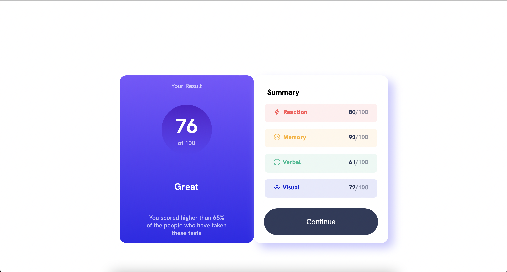
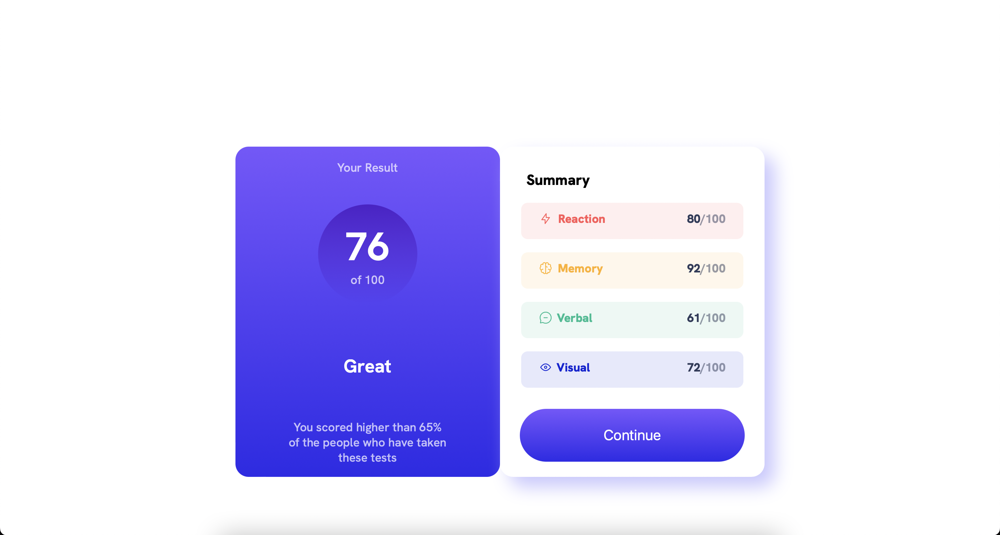
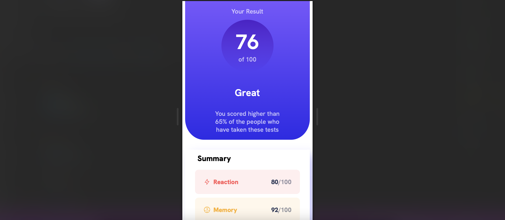
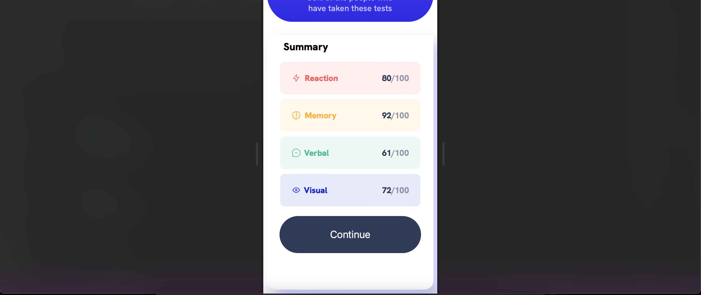

## Table of contents

- [Overview](#overview)
  - [The challenge](#the-challenge)
  - [Screenshot](#screenshot)
- [My process](#my-process)
  - [Built with](#built-with)
  - [What I learned](#what-i-learned)
  - [Continued development](#continued-development)
- [Author](#author)


## Overview

### The challenge

Users should be able to:

- View the optimal layout for the interface depending on their device's screen size
- See hover and focus states for all interactive elements on the page

### Screenshots







## My process

### Built with

- HTML5
- CSS
- JavaScript
- Flexbox
- Mobile-first workflow
- VS Code


### What I learned
 
 ...

To see how you can add code snippets, see below:

```html
<h1>Some HTML code I'm proud of</h1>
```
```css
.proud-of-this-css {
  color: papayawhip;
}
```
```js
const proudOfThisFunc = () => {
  console.log('🎉')
}
```


### Continued development

I want to explore how to manipulate and pull data from json files instead of hardcoding it into the HTML file.


## Author

- LinkedIn - [Stefania Piciorea](https://www.linkedin.com/in/stefania-piciorea)
- Twitter - [@StefaniaP1011](https://www.twitter.com/StefaniaP1011)


